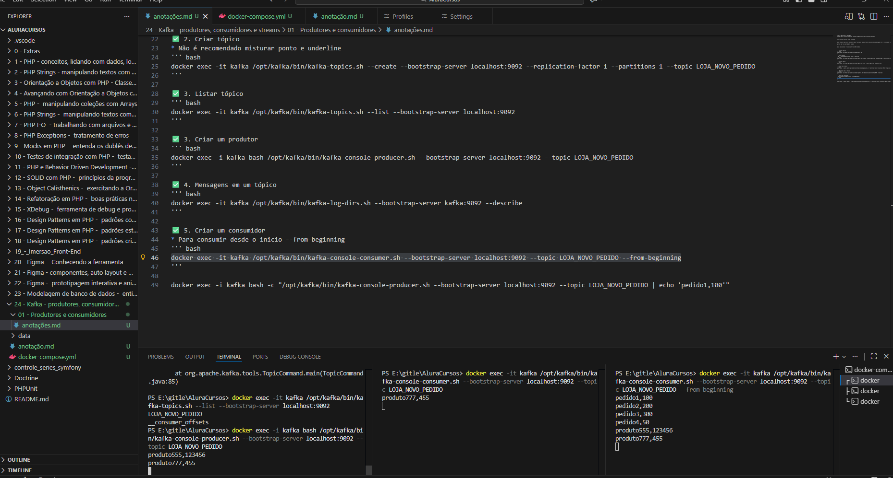
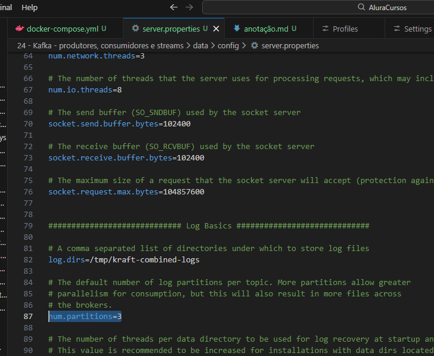

# Geral
## Iniciar Kafka
docker-compose up -d

## logs
docker ps -a kafka

# 01 - Produtores e Consumidores

Broker - gerencia as mensagens
zookeper para armazenar dados em versões antigas nas versões recentes usa kraft

Producer -> Produtor -> Quen envia a mensagem
Consumer -> Consumidor -> Quem consome a mensagem

Os servidores destinos ficam escutando

Kafka permite uma escala horizontal mais facil pois cada servidor adicional busca mensagem nele e processando corretamente

"parece uma fila extremamete tunada"

Daria para colocar vários cluster com 30 brokens

✅ 1. Listar tópicos
''' bash
docker exec -it kafka /opt/kafka/bin/kafka-topics.sh --bootstrap-server localhost:9092 --list
'''

✅ 2. Criar tópico
* Não é recomendado misturar ponto e underline
''' bash
docker exec -it kafka /opt/kafka/bin/kafka-topics.sh --create --bootstrap-server localhost:9092 --replication-factor 1 --partitions 1 --topic LOJA_NOVO_PEDIDO
'''

✅ 3. Listar tópico
''' bash
docker exec -it kafka /opt/kafka/bin/kafka-topics.sh --list --bootstrap-server localhost:9092
'''

✅ 4. Criar um produtor
''' bash
docker exec -i kafka bash /opt/kafka/bin/kafka-console-producer.sh --bootstrap-server localhost:9092 --topic LOJA_NOVO_PEDIDO
'''

✅ 5. Mensagens em um tópico
''' bash
docker exec -it kafka /opt/kafka/bin/kafka-topics.sh --bootstrap-server localhost:9092 --describe
'''

✅ 6. Criar um consumidor
* Para consumir desde o inicio --from-beginning
''' bash
docker exec -it kafka /opt/kafka/bin/kafka-console-consumer.sh --bootstrap-server localhost:9092 --topic LOJA_NOVO_PEDIDO --from-beginning
'''

✅ 7. Resetar registro de group id consumidor
* se um consumidor parar de receber vale a pena redefinir o offset
''' bash
docker exec -it kafka /opt/kafka/bin/kafka-consumer-groups.sh --bootstrap-server localhost:9092 --group FraudDetectorService --reset-offsets --to-earliest --execute --topic ECOMMERCE_NEW_ORDER
'''

✅ 8. Validar os grupos
''' bash
docker exec -it kafka /opt/kafka/bin/kafka-consumer-groups.sh --bootstrap-server localhost:9092 --all-groups --describe
'''

# 02-Paralelizando tarefas em um servidor

## dicas
- É necessário um número igual ou superior de partições em relação ao número de consumer
- Chave define a partição que cai
- Padrão de Mercado props.put(ConsumerConfig.MAX_POLL_RECORDS_CONFIG, "1");

## Rebalancer tópicos
- Para default em novos tópicos mudar o **server.properties** -> **num.partitions**, claro será necessário reiniciar o servidor e isso não afeta partições existentes

✅ 7. Aleterar tópico
''' bash
docker exec -it kafka /opt/kafka/bin/kafka-topics.sh --alter --bootstrap-server localhost:9092 --topic ECOMMERCE_NEW_ORDER --partitions 3
'''