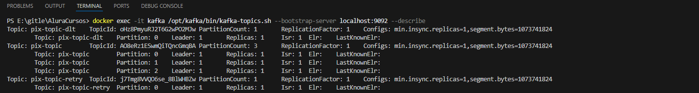
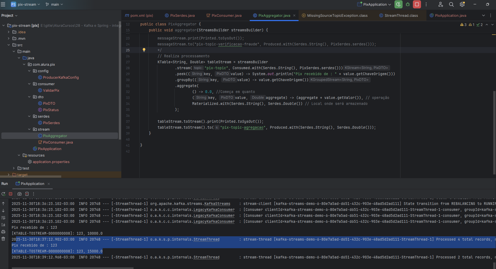
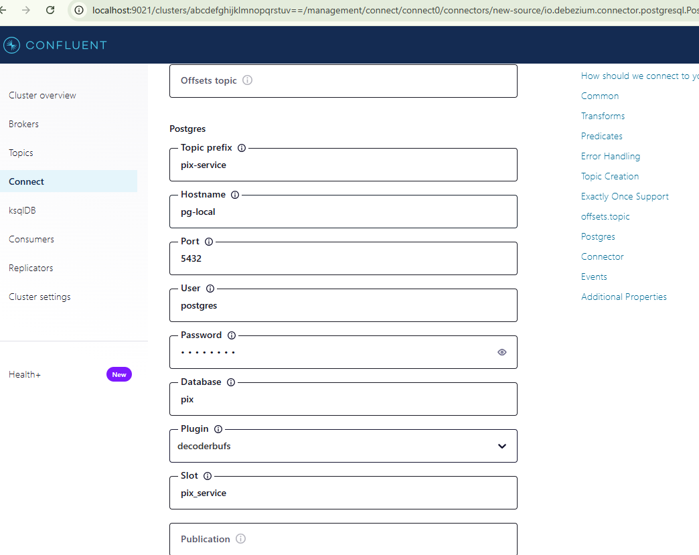
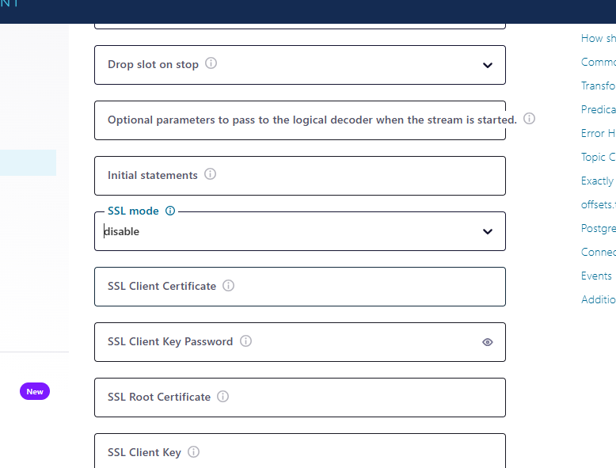

# Geral
## Start Kafka

docker compose up --force-recreate

## Accesses

curl --location 'http://localhost:8080/pix' \
--header 'Content-Type: application/json' \
--data '{
    "chaveOrigem": "123",
    "chaveDestino": "456",
    "valor": 5000
}'

# 01. Kafka com Spring
- Váriaveis de ambiente windows sobrescrevem application.properties

- Permite restringir o caminho dos pacotes para deserialização para evitar ataques (obrigatório)
''' java
        props.put(
                JsonDeserializer.TRUSTED_PACKAGES,
                "*");
'''

# 02. Configurando a conexão com o Kafka 

Para configurar grupo podemos alterar na anotação @KafkaListener(topics = "pix-topic", groupId = "grupo")

## Novas tentativas
Para recriar topicos podemos usar
@RetryableTopic(backoff = @Backoff(value = 3000L), attempts = "5", autoCreateTopics = "true", include = Exception.class)

backoff - tempo entre as tentativas
attemps - tentativas
autoCreateTopis - Cria topico novo para ter ideia de retentativa
include - Exeções para fazer as tentativa

 docker exec -it kafka /opt/kafka/bin/kafka-topics.sh --bootstrap-server localhost:9092 --describe

- criou o tópico pix-topic-retry onde armazena as mensagens para novas tentativas
- criou o tópico pix-topic-dlt onde armazena as mensgaens que persistem dando errado

# 03. Kafka Streams
batch - processa só quando todos os dados estão disponíveis (relatório, vídeo completo)
stream - processa assim que disponível (stream de vídeos, parte de vídeo)

As vezes demora mas a agregação ocorre 

# 04. Schema Registry

Para usar essa feramenta será necessário o  Confluent Kafka

- Schema Registry é algo que podemos colocar um validador no tópico para evitar mensagens fora de padrão (essa ferramenta é fora do kafka)
- Ao invés de usar GSON agora usará AVRO

use para gerar código avro
mvn clean generate-sources

# 05. Kafka Connect
Permite gerar comandos semelhantes a trigger, mas que no caso do kafka manda para tópicos, por exemplo ao inserir um registro enviar para o tópico x uma mensagem

Pode conectar em vários banco relacionais ou não File Storage e aplicações

- Adicionar connector
    - http://localhost:9021/clusters/abcdefghijklmnopqrstuv==/management/connect/connect0/connectors/browse //connect -> new connect
    - PostgresConnector

{
  "name": "PostgresConnectorConnector_0",
  "config": {
    "name": "PostgresConnectorConnector_0",
    "connector.class": "io.debezium.connector.postgresql.PostgresConnector",
    "topic.prefix": "pix-service",
    "database.hostname": "pg-local",
    "database.port": "5432",
    "database.user": "postgres",
    "database.password": "********",
    "database.dbname": "pix",
    "plugin.name": "decoderbufs",
    "slot.name": "pix_service",
    "database.sslmode": "disable",
    "table.include.list": "public.pix"
  }
}
