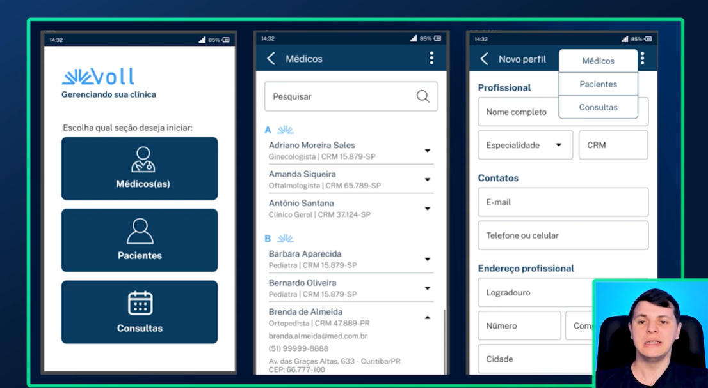
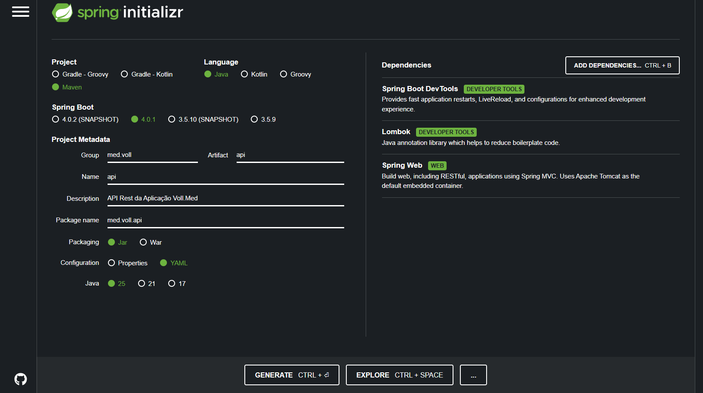
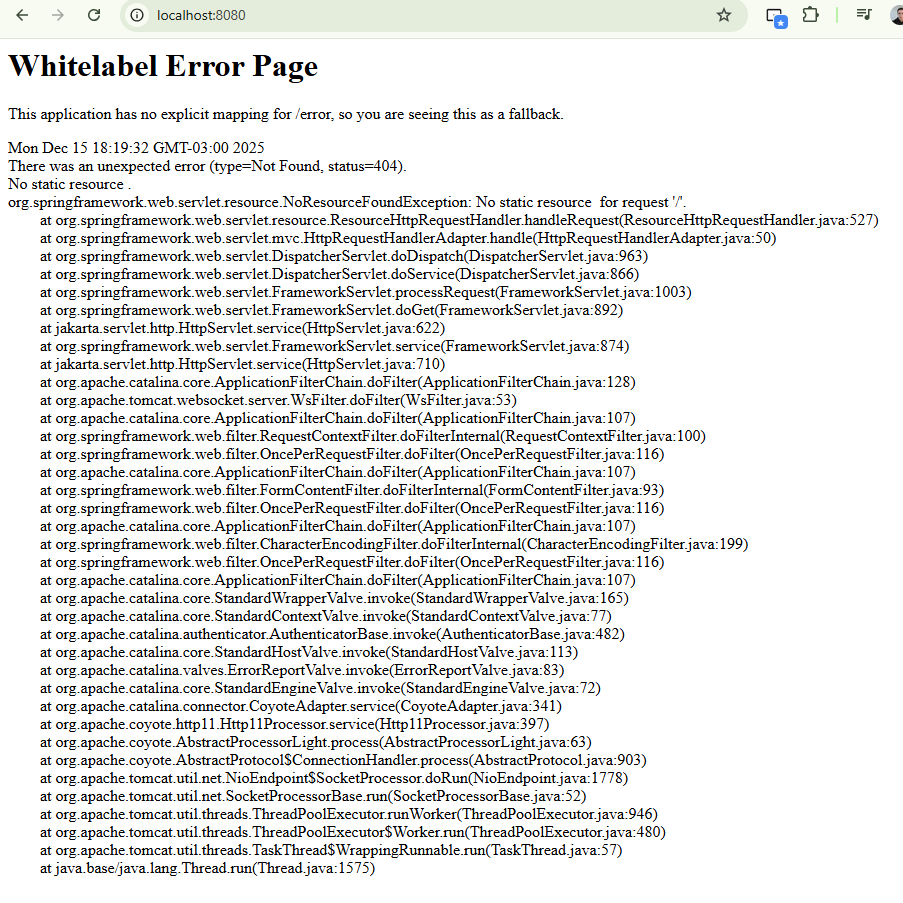
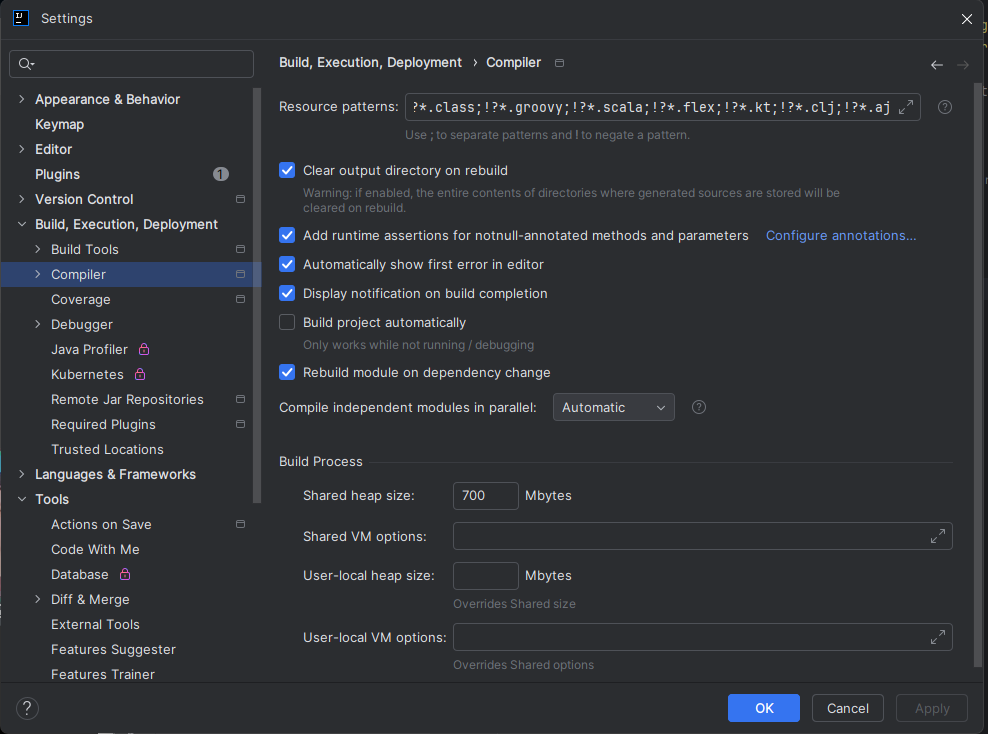
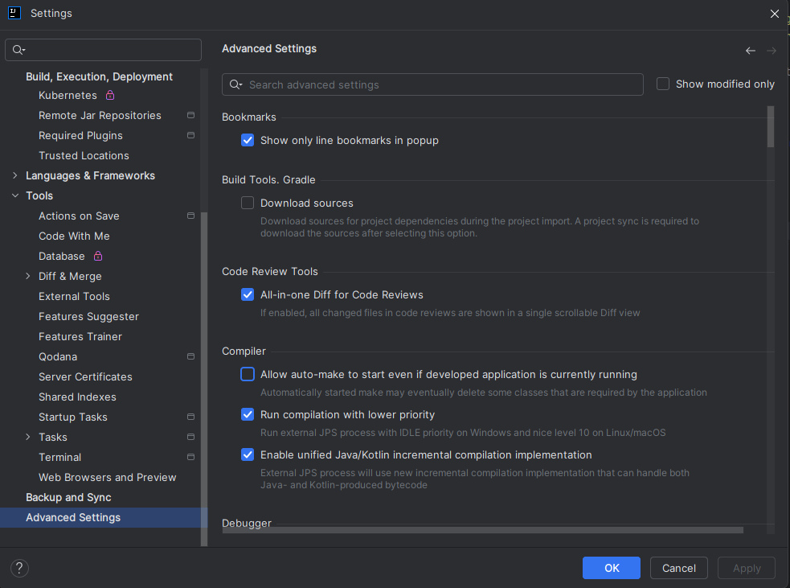
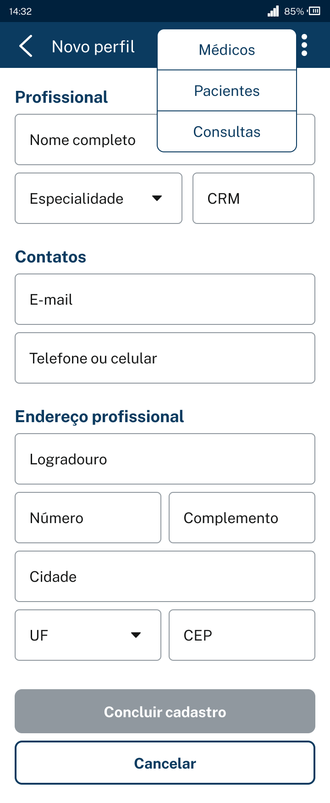
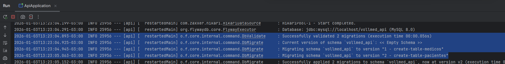
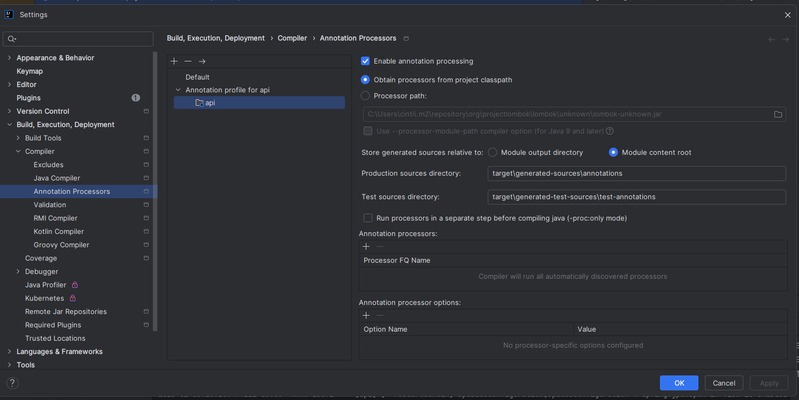
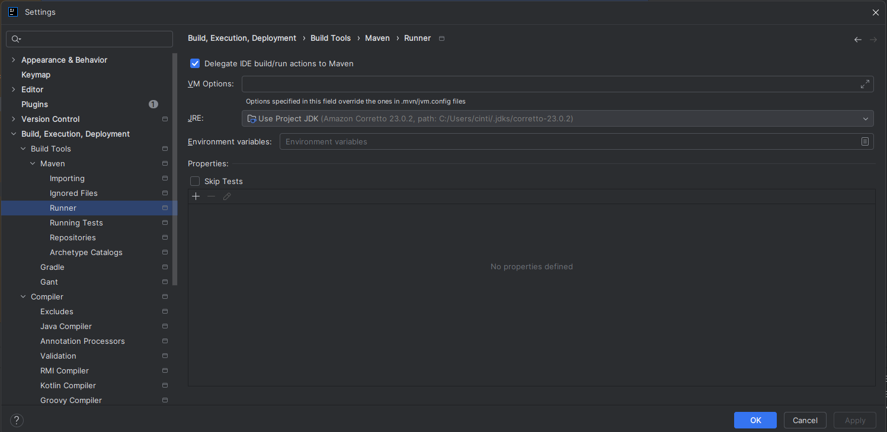

# Atalhos 
Alt + INS - Inclui algum objeto
ALT + Enter - Criar uma classe que não existe


# Comandos
- Iniciar o banco
``` bash
docker-compose up
```


# 1. Criação do Projeto


## Spring Initializr - Cria a base do projeto direto

1. Acessar `start.spring.io`


``` yaml
<parent>
    <groupId>org.springframework.boot</groupId>
    <artifactId>spring-boot-starter-parent</artifactId>
    <version>4.0.1</version>
    <relativePath/> <!-- lookup parent from repository -->
</parent>
```
Spring Boot possui um pom próprio e nossa aplicação herda esse pom, quando inserimos uma dependência do spring, não é necessário informar a versão pois ela será herdada desse pom original.

Em uma aplicação java nativa usamos o Tomcat, Jet, Glassfish, weblogic cmo Servidores de java web.

Porém no Spring o Tomcat já é incluso internamente


- Para Spring 4.0.1 precisei usar o java 23 parece que ele não suporta o java 25

* Acessar página após subir a aplicação
http://localhost:8080/



## Configurar IDE
* Maracar Build project automatically


* allow auto make


## Exemplo 

Spring MVC (não precisa do bot)

``` java
package med.voll.api.controller;

import org.springframework.web.bind.annotation.GetMapping;
import org.springframework.web.bind.annotation.RequestMapping;
import org.springframework.web.bind.annotation.RestController;

@RestController // Indica ao spring que essa classe é um controller que trabalha com rest
@RequestMapping("/hello") // Indica o path que responde
public class HelloController {

    @GetMapping // Indica que será o método get responsável
    public String helloWorkdld () {
        return "Hello World Spring";
    }
}
```

# 2. Requisições POST
> [Tarefas](https://trello.com/b/O0lGCsKb/api-voll-med)

> [Telas Front](https://www.figma.com/design/N4CgpJqsg7gjbKuDmra3EV/Voll.med)

## Cadastro de Médico



``` bash
curl --location 'http://localhost:8080/medicos' \
--header 'Content-Type: application/json' \
--data-raw '{
    "nome": "Rodrigo Ferreira",
    "email": "rodrigo.ferreira@voll.med",
    "crm": "123456",
    "especialidade": "ortopedia",
    "endereco": {
        "logradouro": "rua 1",
        "bairro": "bairro",
        "cep": "12345678",
        "cidade": "Brasilia",
        "uf": "DF",
        "numero": "1",
        "complemento": "complemento"
    }
}'
```

- Caso der problema de CORS
``` java
@Configuration
public class CorsConfiguration implements WebMvcConfigurer {

    @Override
    public void addCorsMappings(CorsRegistry registry) {
        registry.addMapping("/**")
            .allowedOrigins("http://localhost:3000")
            .allowedMethods("GET", "POST", "PUT", "DELETE", "OPTIONS", "HEAD", "TRACE", "CONNECT");
    }
}
```

## Cadastro de Paciente

``` bash
curl --location 'http://localhost:8080/pacientes' \
--header 'Content-Type: application/json' \
--data-raw '{
    "nome": "Matheus Ferreira",
    "email": "matheus.ferreira@yahoo.com.br",
    "cpf": "111.111.111-11",
    "telefone": "(55) 99696-2589",
    "endereco": {
        "logradouro": "rua 5",
        "bairro": "flores",
        "cep": "95589663",
        "cidade": "Brasilia",
        "uf": "DF",
        "numero": "1"
    }
}'
```

# 3. Spring Data JPA

- Através do https://start.spring.io/ podemos pesquisar dependências de uma maneira muito mais simples

- Depois de selecionar as dependencias basta ir em explorar


- Embeddable Attibute
    - notação @Embedded 
    - no jpa isso indica que embora estejam e classes diferentes todos atributos fazem parte da mesma tabela 

- Lombok Anotações
    - @Getter - Gera get de todos atributos
    - @NoArgsConstructor - Gera construtor vazio
    - @AllArgsConstructor - Gera construtor com todos os atributos
    - @EqualsAndHashCode(of = "id") - Gera os métodos equals() e hashCode() usando apenas o campo id sem comparar todos os atributos

- Spring Data não usa DAO (Data Access Object), no lugar ele utiliza interfaces que são as Repository
    - Na Interface criada extenda de JpaRepository e informe dois Generic
        - Tipo da Enitdade
        - Tipo do Atributo Chave Primária

- Spring faz injeção de Dependências mas para isso na declaração do objeto precisa usar a anotação @Autowired
``` java
    @Autowired
    private MedicoRepository repository;
```

### Migration - flyway
- lib para controle de migralçaoi de dados
- Spring já possui suporte
- src/main/repository/db/migration

- Não deixar a API rodando pois se não ele tentará executar

- os arquivo sql devem seguir o padrão de nome "Vx__nome-descritivo.sql" substituir x por algum número



#### erros

execute no banco
``` sql
delete from flyway_schema_history where success = 0;
```
dessa forma todas migration com erro serão limpas

## Validation 
Lib que se integra no Bean Validation
Colocar a anotação no campo
    - @NotNull - Valida o campo a não ser nullo
    - @NotBlank - Campo não pode ser nulo e nem vazio " "
    - @Email - valida campo de email
    - @Pattern(regexp = "") - permite inserir padrões para validar um campo
    - @Valid - Propaga a validação para outro objeto
        - No objeto que ira iniciar deve ter o @Valid no objeto que desejamos inicar a validaçõ
``` java
public void save(@RequestBody @Valid DadosCadastroPaciente dados) {
```
[documentação](https://jakarta.ee/specifications/bean-validation/3.0/jakarta-bean-validation-spec-3.0.html#builtinconstraints)


# 4. Requisições GET

- Anotação para controlar o padrão quando não vem info da request
``` java
public Page<DadosListagemMedico> listar(@PageableDefault(size = 10, page = 0, sort = {"nome"}) Pageable paginacao) {
```
        


Configs interesantes
``` yaml
spring:
  data:
    web:
      pageable:
        page-parameter: page # Define o nome para o parâmetro da url
        size-parameter: size # Define o nome para o parâmetro da url
        default-page-size: 10 # Define o total de registros por página (default 20)
      sort:
        sort-parameter: sort # Define o nome para o parâmetro da url
  jpa:
    show-sql: true # Mostar o Sql executado pelo Hibernate
    properties:
      hibernate:
        format_sql: true # Formata o Sql mostrado
```

# 5. Requisição PUT e DELETE

- Exclusão lógia = inativar no sistema
- findAllByAtivoTrue = nomes especificos fazem o spring data gerar querys automaticamente

# Know Issue

## Problema de @NoArgsConstructor & @AllArgsConstructor

- Causa
    - Anotações do lombok ao criar os binarios não são processadas 

solução


