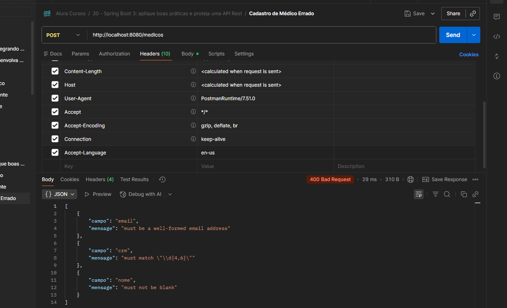

# Atalhos 
Alt + INS - Inclui algum objeto
ALT + Enter - Criar uma classe que não existe


# Comandos
- Iniciar o banco
``` bash
docker-compose up
```


# 1. Boas Práticas na API

[Status Http](https://http.cat/)

# 2. Lidando com erros

[Documentação de Proprieties](https://docs.spring.io/spring-boot/appendix/application-properties/index.html)


Se o erro não for tratado ele sempre será 500

## Remove o stacktrace dos erros retornados nas requisições

``` yml
spring:
  web:
    error:
      include-stacktrace: never # Remove o stacktrace dos erros retornados nas requisições
```

## Mudar a linguagem da requisição
No Cabeçalho usando a propriedade Accept-Language e a linguagem desejada.




## Mensagens personalizadas
Outra maneira é isolar as mensagens em um arquivo de propriedades, que deve possuir o nome ValidationMessages.properties e ser criado no diretório src/main/resources:

``` properties 
nome.obrigatorio=Nome é obrigatório
email.obrigatorio=Email é obrigatório
email.invalido=Formato do email é inválido
telefone.obrigatorio=Telefone é obrigatório
crm.obrigatorio=CRM é obrigatório
crm.invalido=Formato do CRM é inválido
especialidade.obrigatoria=Especialidade é obrigatória
endereco.obrigatorio=Dados do endereço são obrigatórios
```

``` java 
public record DadosCadastroMedico(
    @NotBlank(message = "{nome.obrigatorio}")
    String nome,

    @NotBlank(message = "{email.obrigatorio}")
    @Email(message = "{email.invalido}")
    String email,

    @NotBlank(message = "{telefone.obrigatorio}")
    String telefone,

    @NotBlank(message = "{crm.obrigatorio}")
    @Pattern(regexp = "\\d{4,6}", message = "{crm.invalido}")
    String crm,

    @NotNull(message = "{especialidade.obrigatoria}")
    Especialidade especialidade,

    @NotNull(message = "{endereco.obrigatorio}")
    @Valid DadosEndereco endereco) {}
```

# 3. Spring Security

- Autenticação
- Autorização (controle de acesso)
- Proteção contra ataques (CSRF, clickjacking, etc)
- JWC (JSON Web Tokens)

Stateless (não fica armazenada a autenticação) != Stateful (armazena a sessão do usuário)
API REST != Aplicação Web (Spring MVC)


Quando adicionar a dependência por default o spring começa a bloquear todas request, cria uma página de login e cria o usuário user e a senha gera aleatoriamente e imprime no console.


[Documentação JPA de Nome de métodos](https://docs.spring.io/spring-data/jpa/reference/jpa/query-methods.html)


Para mudar o **Spring Security** de  Stateful para Stateless precisamos:

- Criar uma classe de configuração com a anotação @EnableWebSecurity
``` java 
package med.voll.api.infrastructure.security;

import org.springframework.context.annotation.Bean;
import org.springframework.context.annotation.Configuration;
import org.springframework.security.authentication.AuthenticationManager;
import org.springframework.security.config.annotation.authentication.configuration.AuthenticationConfiguration;
import org.springframework.security.config.annotation.web.builders.HttpSecurity;
import org.springframework.security.config.annotation.web.configuration.EnableWebSecurity;
import org.springframework.security.config.annotation.web.configurers.AbstractHttpConfigurer;
import org.springframework.security.config.http.SessionCreationPolicy;
import org.springframework.security.web.SecurityFilterChain;

@Configuration // Carrega a classe para configurações
@EnableWebSecurity // Mostra para o Spring que vamos alterar configurações do Security
public class SecurityConfigurations {

    @Bean
    public SecurityFilterChain securityFilterChain(HttpSecurity http) {
        http.csrf(AbstractHttpConfigurer::disable); // Desabilitar proteção contra CSRF (Cross-Site Request Forgery) - Token já faz essa segurança
        http.sessionManagement(sm -> sm.sessionCreationPolicy(SessionCreationPolicy.STATELESS)); //Configura autenticação para STATELESS
        return http.build();
    }

    @Bean // Mostra ao spring a como criar um objeto (serve para exportar uma classe para o Spring, fazendo com que ele consiga carregá-la e realize a sua injeção de dependência em outras classes.)
    public AuthenticationManager autenticationManager(AuthenticationConfiguration configuration) {
        return configuration.getAuthenticationManager();
    }

}
```

- Após isso as requisições ficarão liberadas e teremos que fazer nosso próprio processo de autenticação

- Usa-se o Authentication Manager e não diretamente o Authentication Service, no caso o Manager é quem chamará o Service devido as anotações

- Criptografar a senha use o seguinte [site](https://bcrypt-generator.com/) para o formato Bcrypt

``` sql 
insert into 
  usuarios (
    id, 
    login, 
    senha
  )
values
  (
    1, 
    'ana.souza@voll.med', 
    '$2a$12$qy9xk08E9lYunsUSNqB2uuudY0Lm5duq6DjMEhggCXUBaaujjfZNi' # 123456
  );
```