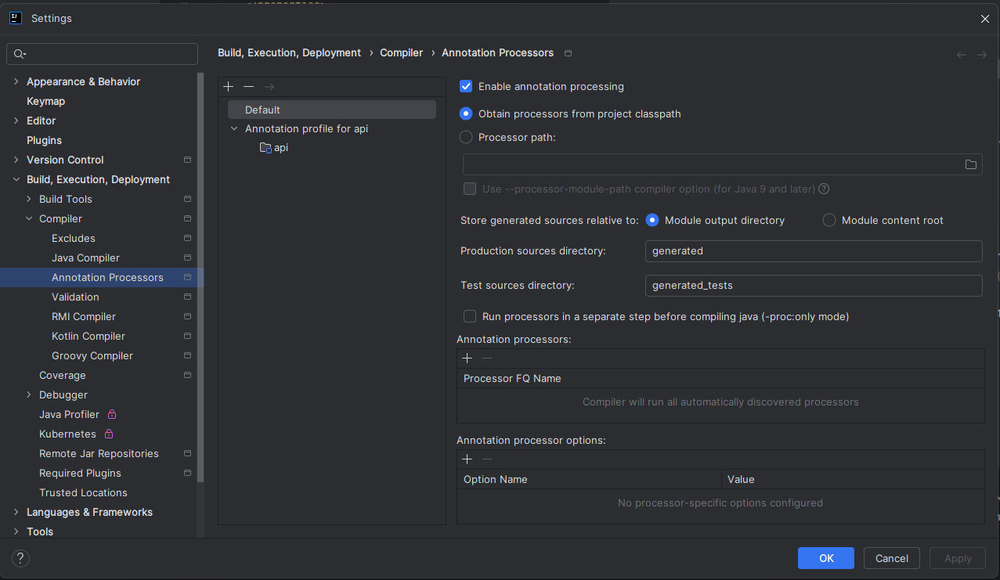
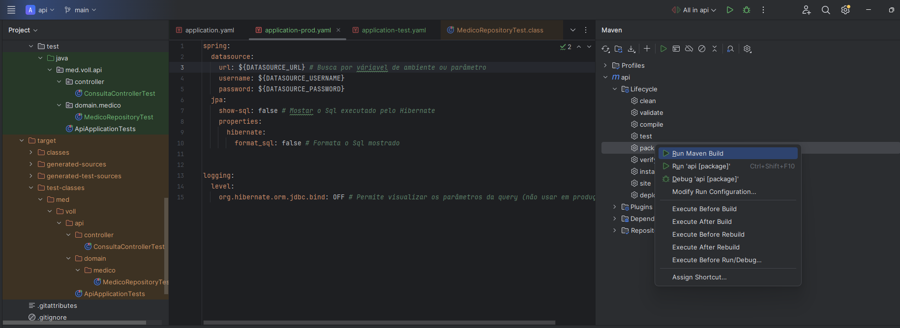
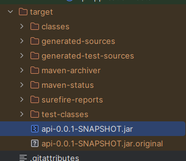

# Atalhos 
Alt + INS - Inclui algum objeto
ALT + Enter - Criar uma classe que não existe

# IDE não usando as anotações do lombok



# Comandos
- Iniciar o banco
``` bash
docker-compose up
```

# Scoop tipo SdkMan

scoop bucket add java
scoop install temurin17
java -version

powershell -ExecutionPolicy Bypass -NoProfile -Command "irm get.scoop.sh | iex"
$env:PATH += ";$HOME\scoop\shims"
scoop install corretto23-jdk

scoop reset corretto23-jdk
scoop list | findstr java

# 1. Agendamento de Consultas

## JsonAlias
permite consumir json cujo o nome dos parâmetros sejam diferentes do padrão do banco.

``` java
public record DadosCompra(
    @JsonAlias({“produto_id”, “id_produto”}) Long idProduto,
    @JsonAlias({“data_da_compra”, “data_compra”}) LocalDate dataCompra
){}
```
## JsonFormat
permite criar formatos diferentes para um campo para validação e consumo

``` java
@JsonFormat(pattern = "dd/MM/yyyy HH:mm")
```

# 2 Regras de Negócio

## Anotação Component
- Não é configuração, serviço, repository ... é um componente genérico
- Spring inicializa a classe e faz a dependency injection 

``` java
@Component
public class ValidadorHorarioAntecedencia implements ValidadorAgendamentoDeConsulta {
```

## Instanciar todas classe que implementam uma interface

- Spring implementa
``` java
@Autowired
private List<ValidadorAgendamentoDeConsulta> validadoresConsultas;
```


# 3 Documentação da API

Lib: https://springdoc.org/


- /swagger-ui.html
- /v3/api-docs

http://localhost:8080/v3/api-docs

# 4 Testes Automatizados
Indicar para o spring usar banco de teste
``` java
@DataJpaTest // Permite testar consultas banco
@AutoConfigureTestDatabase(replace = AutoConfigureTestDatabase.Replace.NONE) // Força usar o banco real (ou de homologação)
@ActiveProfiles("test") // usa ambiente de teste
class MedicoRepositoryTest {

    @Test
    void escolherMedicoAleatorioLivreNaData() {

    }
}
```

application-test.yaml (resto das config vem do application base)
``` yaml
spring:
  datasource:
    url: jdbc:mysql://localhost/vollmed_api_test
```


Como citado no vídeo anterior, podemos realizar os testes de interfaces repository utilizando um banco de dados em memória, como o H2, ao invés de utilizar o mesmo banco de dados da aplicação.

Caso você queira utilizar essa estratégia de executar os testes com um banco de dados em memória, será necessário incluir o H2 no projeto, adicionando a seguinte dependência no arquivo pom.xml:
``` xml
<dependency>
  <groupId>com.h2database</groupId>
  <artifactId>h2</artifactId>
  <scope>test</scope>
</dependency>
```

# 5 Build do Projeto




``` bash
java "-Dspring.profiles.active=prod" "-DDATASOURCE_URL=jdbc:mysql://localhost/vollmed_api" "-DDATASOURCE_USERNAME=app_user" "-DDATASOURCE_PASSWORD=app_pass" -jar target/api-0.0.1-SNAPSHOT.jar
```

ou via docker

``` bash
docker compose --profile prod up
```

## Empacotar war

No pom.xml
``` xml
<project>
  ...
  <packaging>war</packaging>

  ...

  <dependency>
    <groupId>org.springframework.boot</groupId>
    <artifactId>spring-boot-starter-tomcat</artifactId>
    <scope>provided</scope>
  </dependency>
```

Alterar a classe main do projeto (ApiApplication) para herdar da classe SpringBootServletInitializer, bem como sobrescrever o método configure:

``` java
@SpringBootApplication
public class ApiApplication extends SpringBootServletInitializer {

  @Override
  protected SpringApplicationBuilder configure(SpringApplicationBuilder application) {
    return application.sources(ApiApplication.class);
  }

  public static void main(String[] args) {
    SpringApplication.run(ApiApplication.class, args);
  }

}
```

## Native Image
Imagem nativa é uma tecnologia utilizada para compilar uma aplicação Java, incluindo todas as suas dependências, gerando um arquivo binário executável que pode ser executado diretamente no sistema operacional.
No pom.xml
``` xml
<plugin>
  <groupId>org.graalvm.buildtools</groupId>
  <artifactId>native-maven-plugin</artifactId>
</plugin>
```

Geração da imagem

``` bash
./mvnw -Pnative native:compile
```
Atenção! Para executar o comando anterior e gerar a imagem nativa do projeto, é necessário que você tenha instalado em seu computador o GraalVM (máquina virtual Java com suporte ao recurso de Native Image) em uma versão igual ou superior a 22.3.

https://www.graalvm.org/
https://docs.spring.io/spring-boot/reference/packaging/native-image/index.html